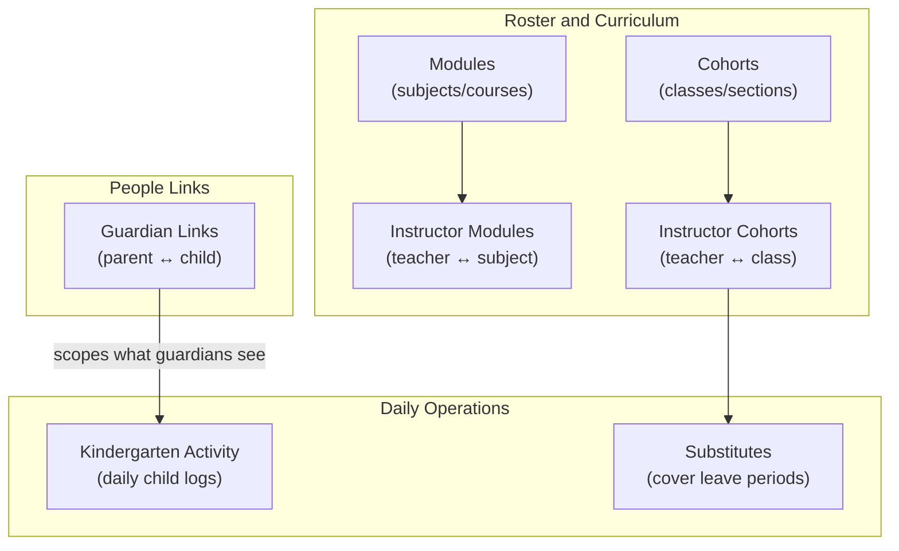

# Access Group Permissions Explained

OneCampus is a multi-tenant educational ERP (kindergarten, school, college) where each tenant gets isolated data and vocabulary-adapted UI. **Access groups** let admins grant extra permissions on top of a user's role defaults — they are **additive only** (never remove access).

The **Create Access Group** page lives at `/app/access-control/new` ([`client/src/features/accessControl/components/AccessControlDetailPage.jsx`](client/src/features/accessControl/components/AccessControlDetailPage.jsx)). It loads all permission strings from `GET /api/v1/access-control/permissions` (defined in [`server/lib/permissions.js`](server/lib/permissions.js)) and groups them by prefix. Labels like **"kindergarten activity"** are auto-generated from the prefix (`kindergarten_activity` → "kindergarten activity").

Each group has sub-permissions, typically:
- **`.view`** — read/list data
- **`.manage`** — create, update, delete
- **`.log`** — write-only action (used only for kindergarten activity)

---

## 1. Kindergarten Activity

**What it is:** A kindergarten-specific feature for logging daily child activity — meal intake, sleep duration, and free-text activity tags — one entry per learner per day.

**Why it exists:** Kindergarten tenants have a different workflow than schools/colleges. This was the first module to use the tenant **module toggle** system (`kindergarten_activity` in `active_modules`).

**Permissions:**
| Permission | What it allows |
|---|---|
| `kindergarten_activity.view` | List/read activity logs (optionally filtered by learner/date) |
| `kindergarten_activity.log` | Create or update a learner's daily entry |

**Where in the app:** `/app/kindergarten-activity` (sidebar, kindergarten tenants only)

**Default roles:** Admin and instructor get both; learner and guardian get `.view` only; staff get neither by default.

**Docs:** [`server/modules/kindergartenActivity/README.md`](server/modules/kindergartenActivity/README.md)

---

## 2. Modules

**What it is:** The curriculum catalog — subjects, courses, or activities depending on institution type. Stored in `onec_modules`; the UI label adapts via tenant vocabulary (e.g. "Subject" for schools, "Course" for colleges, "Activity" for kindergarten).

**Important naming note:** "Modules" here means **educational subjects/courses**, not software modules. The name matches the database table `onec_modules`.

**Permissions:**
| Permission | What it allows |
|---|---|
| `modules.view` | List/read subjects/courses |
| `modules.manage` | Create, edit, delete subjects/courses |

**Where in the app:** `/app/modules` — also used as dropdown data in evaluations and other forms.

**Default roles:** Admin gets both; instructor gets `.view` only.

**Docs:** [`server/modules/modules/README.md`](server/modules/modules/README.md)

---

## 3. Guardian Links

**What it is:** The many-to-many relationship between **learners (students)** and **guardians (parents)** in `onec_learner_guardian_map`. This is the data that powers **row-level scoping** for guardian accounts — a guardian only sees attendance, scores, certificates, kindergarten activity, etc. for children they are linked to.

**Permissions:**
| Permission | What it allows |
|---|---|
| `guardian_links.view` | See which learners are linked to which guardians |
| `guardian_links.manage` | Create or remove learner–guardian links (staff-side) |

**Where in the app:**
- `GuardianLinksModal` on the Guardians page
- `LearnerGuardianLinksModal` on the Learner profile page (when user has `.manage`)

**Default roles:** Admin gets both; guardian gets `.view` only (to see their own links, not manage them).

**Docs:** [`server/modules/guardianLinks/README.md`](server/modules/guardianLinks/README.md)

---

## 4. Substitutes

**What it is:** Substitute-teacher assignment when an instructor's leave is approved. Bridges the gap between the **Leave** and **Timetable** modules — shows which scheduled periods need covering during a leave and lets staff assign a substitute instructor.

**Permissions:**
| Permission | What it allows |
|---|---|
| `substitutes.view` | View coverage for a leave request (which periods need covering, who is assigned) |
| `substitutes.manage` | Assign or remove substitute instructors for specific periods |

**Where in the app:** `SubstituteCoverageModal` on the Leave page.

**Default roles:** Admin and staff get both; instructor gets `.view` only (see who covers their classes, or what they are covering for others).

**Docs:** [`server/modules/substitutes/README.md`](server/modules/substitutes/README.md)

---

## 5. Instructor Modules

**What it is:** Which **subjects/courses a teacher is qualified to teach** — stored in `onec_instructor_modules`. This is a lightweight roster link, separate from timetable slot allocations (`onec_allocations`). A teacher can be qualified for multiple subjects even if they are not currently scheduled to teach all of them.

**Permissions:**
| Permission | What it allows |
|---|---|
| `instructor_modules.view` | List which subjects each instructor can teach |
| `instructor_modules.manage` | Add or remove instructor–subject links |

**Where in the app:** "Teacher Subjects" tab/modal on the Instructors page (`InstructorModulesModal`).

**Default roles:** Admin gets both; instructor gets `.view` only.

**Docs:** Migration comment in [`server/migrations/030_add_instructor_module_cohort_links.sql`](server/migrations/030_add_instructor_module_cohort_links.sql)

---

## 6. Instructor Cohorts

**What it is:** Which **classes/sections a teacher is assigned to** — stored in `onec_instructor_cohorts`. A class can have multiple teachers; an instructor can co-teach multiple classes. Used for "My Classes" views, class-channel membership, and assignment scoping.

**Permissions:**
| Permission | What it allows |
|---|---|
| `instructor_cohorts.view` | List which classes each instructor is assigned to |
| `instructor_cohorts.manage` | Add or remove instructor–class links |

**Where in the app:** "Teachers" tab on the Cohort detail page; also used for class channel member management.

**Default roles:** Admin gets both; instructor gets `.view` only.

**Docs:** Same migration file as instructor modules above.

---

## How These Relate to Each Other

---

## Quick Reference: Default Permissions

| Access group label | Admin | Staff | Instructor | Learner | Guardian |
|---|---|---|---|---|---|
| kindergarten activity | view + log | — | view + log | view | view |
| modules | view + manage | — | view | — | — |
| guardian links | view + manage | — | — | — | view |
| substitutes | view + manage | view + manage | view | — | — |
| instructor modules | view + manage | — | view | — | — |
| instructor cohorts | view + manage | — | view | — | — |

Granting any of these via an access group **adds** those permissions on top of the user's role. Example: giving `modules.manage` to a staff user lets them manage the subjects roster even though staff's default permissions do not include modules.

---

## When to Grant These via Access Groups

- **Staff user needs to manage subjects** → grant `modules.view` + `modules.manage`
- **Staff user needs to link parents to children** → grant `guardian_links.view` + `guardian_links.manage`
- **Staff user needs to log kindergarten daily activity** → grant `kindergarten_activity.view` + `kindergarten_activity.log` (kindergarten tenant only)
- **Staff user needs to assign teachers to classes/subjects** → grant `instructor_cohorts.*` and/or `instructor_modules.*`
- Substitutes permissions are already on staff by default; access groups are mainly useful if you want to give substitute management to a non-staff user

No code changes are required — this is purely a permissions/configuration question.
